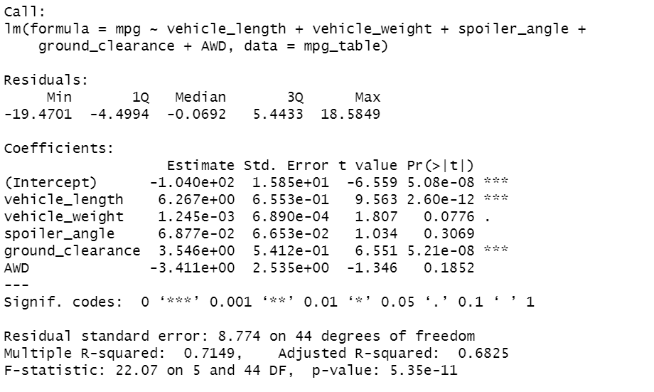

# MechaCar_Statistical_Analysis
## Linear Regression to Predict MPG

__Which variables/coefficients provided a non-random amount of variance to the mpg values in the dataset?__
    
    The vehicle length and vehicle ground clearance are statistically likely to provide a non-random amount of variance 
    to the model. 

__Is the slope of the linear model considered to be zero? Why or why not?__
    
    According to our analysis, the p-value is 5.35e-11 which is smaller than the assumed significance level of 0.05%. We have 
    enough evidence to reject the null hypothesis.  Therefore, the slope of the linear model is not zero.

__Does this linear model predict mpg of MechaCar prototypes effectively? Why or why not?__

    The model does predict mpg of MechaCar prototypes effectively as the linear model has an r-squared value of 0.7149 which 
    means 71% of all mpg predictions are determined by the model. 
    

## Summary Statistics on Suspension Coils

__The design specifications for the MechaCar suspension coils dictate that the variance of the suspension coils must not exceed 100 pounds per square inch. Does the current manufacturing data meet this design specification for all manufacturing lots in total and each lot individually? Why or why not?__

    When observing the entire population of the production lot, the variance of coils is 62.29 PSI which falls within the 100 PSI requirement. Taking a deeper dive into the lots we can observe that lot 1 and two are well within the 100 psi requirement. However, lot 3 is showing a larger variance in performance with a variance of 170.29. 

## T-Tests on Suspension Coils
    According to the t.test lot 1 has a true sample mean of 1500 and a p-value of 1. Therefore we cannot reject the null 
    hypothesis that there is no statistical difference between the observed sample mean the presumed population mean of 1500.
    
    As for lot 2 the sample mean is the same as lot 1 and the p-value of 0.61 prevents us from rejecting the null hypothesis. 
    Indicating the sample mean and population mean of 1500 are statistically similar. 
    
    However, lot 3 is different. The sample mean is 1496.14 and the p-value is 0.4 which is lower than the common significance
    level of 0.05. Therefore, we reject the null hypothesis. Indicating the sample mean and population mean of 1500 are not 
    statistically similar. 

## Study Design: MechaCar vs Competition
__Write a short description of a statistical study that can quantify how the MechaCar performs against the competition. In your study design, think critically about what metrics would be of interest to a consumer: for a few examples, cost, city or highway fuel efficiency, horsepower, maintenance cost, or safety rating.
In your description, address the following questions:__

__What metric or metrics are you going to test?__
    
    The metrics that will be tested and compared with competitors to determine fuel efficiency are the miles per gallon (mpg).
    
__What is the null hypothesis or alternative hypothesis?__

    The null hypothesis is that miles per gallon (mpg)  will be consistent across all car manufacturers. The alternative 
    hypothesis is that mpg will not be consistent with at least one manufacturer.
__What statistical test would you use to test the hypothesis? And why?__

    The best statistical test to use to test the hypothesis is ANOVA. It is preferred over the t-test and can be useful in 
    testing the means of continuous numerical variable of  fuel efficiency (mpg) across various manufacturer. 

__What data is needed to run the statistical test?__

    The data need to run the statistical test include the miles per gallon (mpg) for both MechaCar and competitors. 
    By increasing the sample size we can reduce the probability of error and improve the confidence interval.
